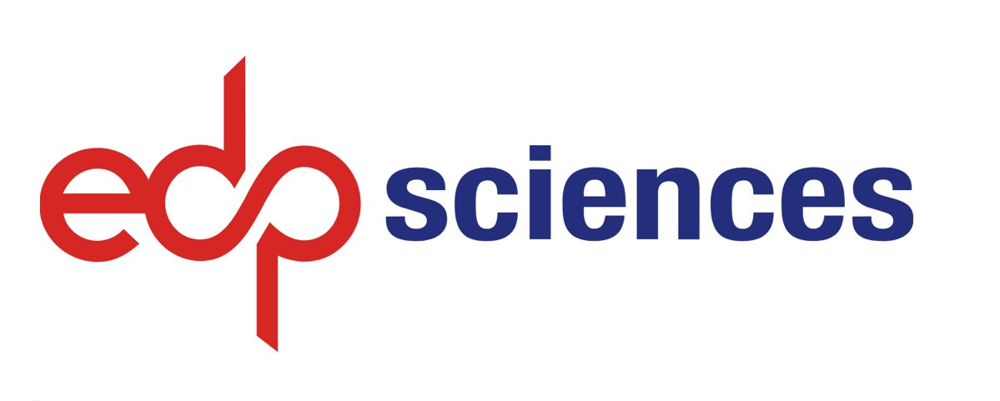

<!-- Home Intro
================================================== -->
 

  

    

      <!--h1 class="font-weight-bold mb-4 serif-font" style="color:#fff">ICSGET 2025</h1-->
      <h2 class="mb-4" style="color:#ffffff">3rd International Conference on Sustainable Green Energy Technologies (ICSGET 2025)</h2>
	  <h3 class="mb-4" style="color:#ffffff">25 - 26 January 2025</h3>
	  <h4 class="mb-4" style="color:#ffffff">Organized by Department of EEE, Vardhaman College of Engineering</h4>
      <a href="{{site.baseurl}}/submission" class="btn btn-dark text-white px-5 btn-lg">Submit your paper</a>
    

    

            
    

  



&nbsp;
## ICSGET 2025

The 3rd International Conference on Sustainable Green Energy Technologies (ICSGET 2025) is conducted by the Department of Electrical and Electronics Engineering, Vardhaman College of Engineering, Hyderabad. The main aim of this international conference is to bring together researchers to facilitate knowledge sharing in emerging technologies and enhance collaboration world over. Along with researchers, the professionals and executives from energy sector, manufacturing industries, electrical power companies are invited to share their ideas and information pertaining to recent thrust areas of sustainable green energy technologies. The conference will enable the delegates to undertake collaborative research, update their technical knowledge and to stay in tune with recent advances. The technical program consists of keynote lectures, peer-reviewed paper presentations, panel discussions and presentations by industry professionals. It is envisaged that the conference will provide a platform where opportunities for national and international collaboration amongst top universities (from India and abroad) is plentiful.

&nbsp;

---

&nbsp;

	

		

			
		

		

			<h3>Important Dates</h3>
			

			<ul>
			<li>Firm deadline: May 01, 2024</li>
			<li>Author Notification: May 20, 2024</li>
			<li>Camera-Ready Submission: May 30, 2024</li>
			<li>Conference Date: June 14, 15, 2024</li>
			</ul>
		

	

&nbsp;

---

&nbsp;

	

		

			<h2>Conference Proceedings</h2>
			

			
All accepted and registered (presented) papers is planned to publish in the proceedings of E3S Web of Conferences.

		

		

			
		

	

&nbsp;

---

&nbsp;

#### About Vardhaman College of Engineering
Vardhaman College of Engineering (VCE) was established in the year 1999 by Vardhaman Educational Society, Hyderabad. It is a UGC Autonomous college, approved by AICTE, and is permanently affiliated to Jawaharlal Nehru Technological University (JNTU), Hyderabad. We offer undergraduate B.Tech programmes in CSE, CSE (AI&ML), AI&ML, AI&DS, IT, ECE, EEE, ME and CE of total intake of 1380; postgraduate M.Tech programmes with specialisation in DECS, PEED, CSE, SE, and ED; MBA programme of total intake of 150; and doctoral programmes in CSE, ECE and ME. The college is accredited by NAAC at A++ grade with a CGPA of 3.58 on a scale of 4. Six of its UG engineering programmes – B. Tech ECE, EEE, CSE, ME, CE, and IT are accredited by the National Board of Accreditation (NBA), New Delhi under the Tier-1 category. VCE is the most sought-after institute to make the dreams fulfilled for many aspiring engineers. Our major strength lies in imparting quality education to the global standards and envisages to address various societal needs.
<a href="vardhaman.org" class="btn btn-dark text-white px-5 btn-lg">www.vardhaman.org</a>
&nbsp;

---
