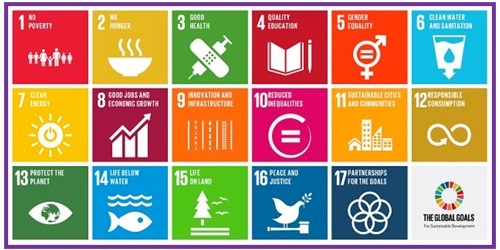
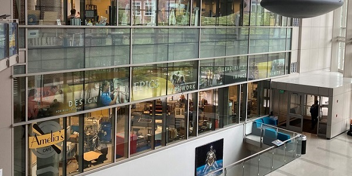
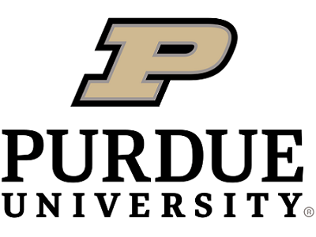
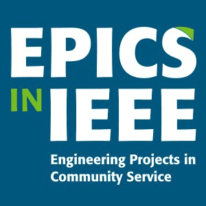
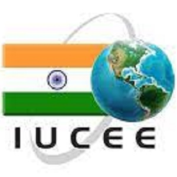
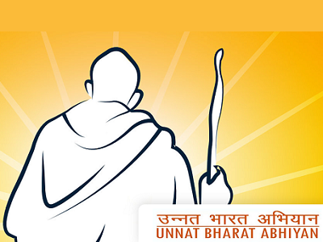
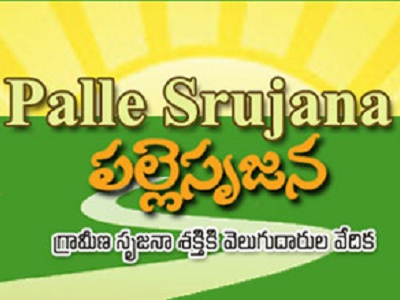

<!-- Home Intro
================================================== -->
 

  

    

      <h1 class="font-weight-bold mb-4 serif-font" style="color:#fff">EPICS</h1>
      <h2 class="mb-4" style="color:#F8931F">Vardhaman College of Engineering</h2>
      <!--a href="{{site.baseurl}}/about" class="btn btn-dark text-white px-5 btn-lg">About me</a-->
    

    

            
    

  



&nbsp;
## EPICS @ VARDHAMAN

VCE - Engineering Projects in community Services (VISn @ V – Viable Innovative Solutions for community needs at Vardhaman) is one of the best practices in Vardhaman Campus. EPICS is a unique programme in which teams of undergraduates design, build, and deploy real systems to solve engineering problems for local community service and educational organizations.The programme focuses on identifying the needs of the society and providing a viable and sustainable solution.

&nbsp;

---

&nbsp;

	

		

			
		

		

			<h3>Objectives</h3>
			

			<ul>
				<li>To meet the vision of the college to address the societal issues and to make the students socially responsible.</li>  
				<li>To provide a viable solution for the problems identified in the community partner.</li>  
			</ul>
		

	

&nbsp;

---

&nbsp;
#### EPICS in Curriculum

Initially EPICS was a non-credit programme and was carried out for six hours in a week where the students were motivated to come voluntarily and work on the societal issues that they identified. Students went for a survey in their first year and identified the problems in villages and they started working on the solutions. To carry out this programme faculty got trained from Dr. William Oakes, Director of EPICS,Purdue University, Using online and offline mode. Initially an EPICS workshop was conducted by Dr.Oakes to get a basic idea, and 15 faculty got certified on Design Thinking, a six-month course. 15 faculty are the mentors for the students. In April 2018 Vardhaman has signed an MOU with EPICS in IEEE and EPICS, Purdue University to make V-EPICS a part of curriculum. As a result,now EPICS has become a part of our Curriculum with four courses in the R18 regulations and revised year by year improving the content and also the making the things better for learning.

&nbsp;

---

#### Featured Projects

&nbsp;

---

&nbsp;

	

		

			<h3>EPICS History</h3>
			

			
EPICS stands for Engineering Projects in Community Service. The program was founded in 1995 at <a href="https://engineering.purdue.edu/EPICS/"  target="_blank"> Purdue University</a>. It was created to meet a two-fold challenge: providing community service organizations with technology they need to improve and deliver services, and providing undergraduate students with educational experiences to broaden their skills. The program has now spread to universities throughout the United States and abroad, as well several K-12 programs.

		

		

			
		

	

&nbsp;

---

&nbsp;

#### The Context
The major challenge is to bring the two groups together in a mutually beneficial way (the Students and the Community). It was specifically to address this challenge that the V-EPICS programme was launched. The V-EPICS programme connects engineering with community service in four verticals of community improvement effort as defined by EPICS in IEEE:

        

            

                
<h5>Access and Abilities</h5>

					
By bringing together student branches at universities, secondary students and non-profit organizations, there is a greater ability to solve accessibility issues within communities. As students learn to help their community or country through engineering projects, non-profit organizations establish themselves in order to maintain new and profound change. The Access and Abilities projects help enable adaptive services, clinics for those in need (such as children with disabilities), me for adults and assistive technologies.

            

        

			
		

            

                
<h5>Education and Outreach</h5>

					
To help young students and to discover the benefits of science, math, technology and engineering for their future, many projects give students hands-on experience in order to stimulate their interests in those fields. Communities and schools lacking in strong engineering programmes gain new curriculum along with new facilities in which to explore new areas of the topic.

            

        

			
		

            

                
<h5>Environment</h5>

					
Engineering and science are key solutions to answering environmental issues. The evolution of technology brings changes in the environment creating the need for sustainability, with new ways to create electricity and energy, recycling and the use of renewable energy sources.

            

        
		
		
		

            

                
<h5>Human Services</h5>

					
Includes homelessness prevention, affordable housing, family and children agencies, neighborhood revitalization and local government.

            

        

&nbsp;

---

&nbsp;

#### Collaborations and Community Partners

  

    
  

  

    
  

  

    
  

  

    
  

  

    
  

