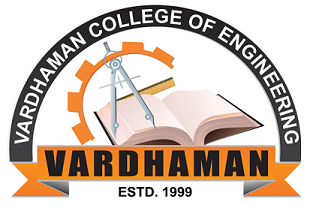

<!-- Home Intro
================================================== -->
 

  

    

      <!--h1 class="font-weight-bold mb-4 serif-font" style="color:#fff">ICSGET 2025</h1-->
      <h2 class="mb-4" style="color:#ffffff">3rd International Conference on Sustainable Green Energy Technologies (ICSGET 2025)</h2>
	  <h3 class="mb-4" style="color:#ffffff">24 - 25 January 2025</h3>
	  <h4 class="mb-4" style="color:#ffffff">Organized by Department of EEE, Vardhaman College of Engineering</h4>
      <a href="{{site.baseurl}}/submission" class="btn btn-dark text-white px-5 btn-lg">Submit your paper</a>
    

    

            
    

  



&nbsp;
## ICSGET 2025

The 3rd The 3rd International Conference on Sustainable Green Energy Technologies (ICSGET 2025) will bring together a diverse group of experts, researchers, and industry professionals, passionate about advancing sustainability. The conference will explore into the latest developments in sustainable technologies in the fields such as smart grids and microgrids, focusing on enhancing grid resilience, cybersecurity, and power quality. New breakthroughs in battery technologies, energy storage, and charging infrastructure will be explored, along with the seamless integration of renewable energy and electric vehicles.  

Showcasing innovations in smart electronics, including energy-efficient designs and wearable technology for health and environmental monitoring, will be a key highlight. Discussions will cover green manufacturing practices and the role of AI in creating more sustainable electronics. The conference will also feature cutting-edge materials for renewable energy and green construction, as well as innovative use of nanomaterials for environmental cleanup and healthcare applications.  

Additionally, the transformative impact of nanotechnology on fields such as solar energy, chemical processes, environmental safety, and health diagnostics will be examined. ICSGET 2025 aims to foster connections, spark new ideas, and share knowledge to address global challenges and promote a greener, more resilient future.

&nbsp;

---
&nbsp;

## Conference Proceedings

	

		

			

			
All accepted and registered (presented) papers are planned to publish in the proceedings of E3S Web of Conferences (EDP Sciences).

		

		

			
		

	

&nbsp;

---
## About Vardhaman College of Engineering

	

		

			
		

		

			

			
Vardhaman College of Engineering (VCE) was established in the year 1999 by Vardhaman Educational Society, Hyderabad. It is a UGC Autonomous college, approved by AICTE, and is permanently affiliated to Jawaharlal Nehru Technological University (JNTU), Hyderabad. We offer undergraduate B.Tech programmes in CSE, CSE (AI&ML), AI&ML, AI&DS, IT, ECE, EEE, ME and CE of total intake of 1380; postgraduate M.Tech programmes with specialisation in DECS, PEED, CSE, SE, and ED; MBA programme of total intake of 150; and doctoral programmes in CSE, ECE and ME. The college is accredited by NAAC at A++ grade with a CGPA of 3.58 on a scale of 4. Six of its UG engineering programmes – B. Tech ECE, EEE, CSE, ME, CE, and IT are accredited by the National Board of Accreditation (NBA), New Delhi under the Tier-1 category. VCE is the most sought-after institute to make the dreams fulfilled for many aspiring engineers. Our major strength lies in imparting quality education to the global standards and envisages to address various societal needs.
			<b>Visit <a href="vardhaman.org">www.vardhaman.org</a></b>

		

	

