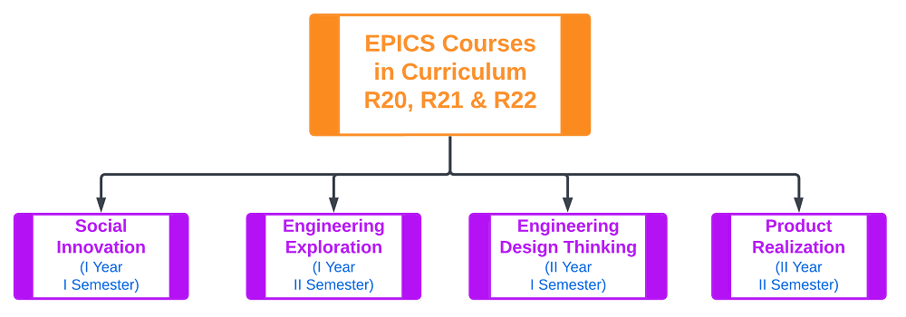

#### EPICS @ Vardhaman

VCE - Engineering Projects in community Services (VISn @ V – Viable Innovative Solutions for community needs at Vardhaman) is one of the best practices in Vardhaman Campus. EPICS is a unique programme in which teams of undergraduates design, build, and deploy real systems to solve engineering problems for local community service and educational organizations.The programme focuses on identifying the needs of the society and providing a viable and sustainable solution.

---

#### EPICS in Curriculum

##### Version #1

##### Version #2

---

#### EPICS Course Mapping to POs
